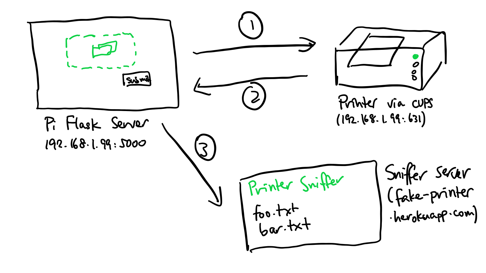
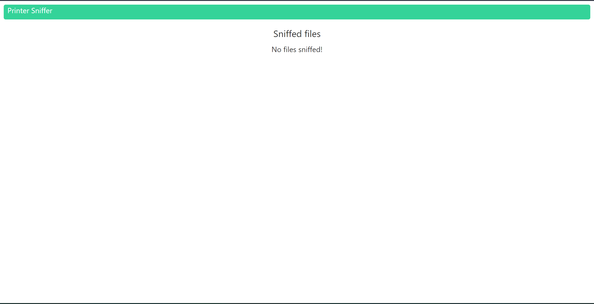
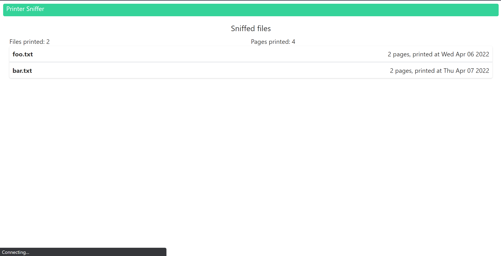

# Something Awesome Project: "Printerception"

## Overview

For my Something Awesome, I decided to use a Raspberry Pi Zero to convert my wired printer into a wireless one - however, when people would use my print server to print files, information about these files would get sniffed en-route and sent over to another server I'm running.

Overall, this project is split up into two sections - the Raspberry Pi "print server" and the sniffer server.

## Running the program

The sniffer server is already up and running at [https://fake-printer.herokuapp.com](https://fake-printer.herokuapp.com) - if you want to see the files that I've printed, simply go to that domain. Because Heroku Redis only supports up to 30MB of storage for free, I didn't want to upload entire files, since they could easily eat into the limited space I have. Instead, I fetch some important metadata from each file (the number of pages printed, when the file was printed etc.) and post that to the sniffer.

If you want to run the website locally, you will need to do the following:
- Download `redis_server` (through `sudo apt install` for Linux)
- Run `redis_server` (the default place Redis runs on is `redis://localhost:6379`)
- Run `export REDISCLOUD_URL="redis://localhost:6379"` - replace if your copy of Redis is running in a different location
- Run `python3 main.py` in the base folder of the sniffer website

The print server can be run by setting up [CUPS](https://openprinting.github.io/cups/) for your relevant printer (can be done on Linux by doing `sudo apt install cups`. You will need to run the CUPS server by doing:

```bash
sudo usermod -aG lpadmin pi
sudo /etc/init.d/cups start
```

Then, in `main.py`:
- Change `PRINTER_NAME` to be the name of that printer after CUPS is set up.
- Change `SERVER_HOST` to the IP address that the website is hosted on if you're running it locally (there were some problems with transmitting data from private address to private address in local testing, so default to `fake-printer.herokuapp.com` if that doesn't work)

After that, run `python3 main.py`, and all you have to do is go into `192.168.1.99:5000`, and print files from there.

## Specifics

### Raspberry Pi

The way the Raspberry Pi server works is through the use of CUPS. Originally, I was going to reverse-engineer my printer driver to see if I can get any information out, but doing so would result in me breaking the law, and I had no experience with printer languages like Postscript. Instead, I used [brlaser](https://github.com/pdewacht/brlaser), which is a collection of CUPS drivers for Brother printers that did most of the job of wiring up my printer for me.

There are two "servers" running on the Pi - the CUPS server (on port 631) and the mini Flask server (on port 5000). My original plan was to see if I could set up a sniffer while files were being sent in transit to port 631, eliminating the need for a Flask server altogether, but I realised that IPP (Internet Printing Protocol, an extension of HTTP that printers use to transmit files over wireless networks) sent raw print instructions instead of the actual `.docx` or `.pdf` files themselves, which meant I couldn't actually read the files once they got sent over (and converting print instructions back into `.docx` files is impossible/illegal).

Below is a flow diagram of how the Flask server works in tandem with CUPS and the external server to harvest data:



1. First, the user uploads a file and presses "Submit". `pycups` then sends that file over to the printer as a print job.
2. The print job ID gets returned from `pycups`, and we wait until the job is finished - we can only get the pertinent data we need when the job is done (e.g. how many pages were needed to print the file). Once that's done, we store that pertinent data in a JSON format.
3. We use `requests` to send that sniffed data over to an external server (`fake-printer.herokuapp.com`), which displays it in a readable format.

I also had both the CUPS server and the Flask print server launch on startup. For the CUPS server, this is done by editing `/etc/rc.local` and adding the line `sudo /etc/init.d/cups start`.

For the Flask server, I have to create a service, since the server has to be run on a separate thread. This is done by creating a `.service` file, `print_server.service`:

```
[Unit]
Description=Service for Flask print server
After=network.target

[Service]
ExecStart=/usr/bin/python3 -u main.py
WorkingDirectory=/home/pi/printing/flask_server
StandardOutput=inherit
StandardError=inherit
Restart=always
User=pi

[Install]
WantedBy=multi-user.target
```

We can then run:

```bash
sudo systemctl daemon-reload
sudo systemctl enable print_server.service
```

And the Flask server will run on startup.

### External Server

The external server was a bit harder to set up - I used Flask, like with the Raspberry Pi, but the website had to look a bit cleaner. Thus, for this project, I decided to learn some frontend libraries - Svelte and Tailwind.

I picked Svelte for the stack because it looked cleaner and took up less space compared to a full React app, and when hosting a website for free on Heroku every little bit of space counts. Tailwind was used because it allowed me to make good designs without using CSS at all, which was definitely a plus in the overall process despite the learning curve.

Here's what the sniffer server looks like when no files have been sniffed yet:



And here's what the sniffer server looks like with some files:



A demo of the entire flow (printing a file from the Flask server, it getting printed, details getting sniffed and published onto the website) can be found in the video.

## Improvements

Some improvements I would make if I had more time are:
- Allow physical file transfer (would have required finding a hosting provider with more storage for free)
- Find a way to make the printing process more seamless - instead of going to a webpage and printing (which might be suspect), what if the victim decided to print straight from Word or Chrome?
- Clean up the UI, and make it look more modern

## Timesheet

Overall, here is the rough amount of hours I spent:
- 2 hours brainstorming ideas
- 3 hours setting up the Raspberry Pi (installing Raspbian, setting a static IP address so it can work as a server)
- 10 hours wiring the Pi to the printer, consisting of:
  - Trying to harvest data using `scapy` (doesn't work, the data being sent over is print instructions which I couldn't use)
  - Trying to listen in `/var/spool/cups` whenever a file gets created, because a file gets made every time a new print job is made (doesn't work, I couldn't set up reading permissions on Linux for that folder)
  - Installing printer drivers straight from Brother (doesn't work, printer would print out blank pages)
  - Installing drivers from `brlaser` (finally worked)
- 5 hours of setting up the Flask print server
- 10 hours of setting up the external server
  - 5 hours of writing up the basic code for the server (Flask, Svelte, Tailwind)
  - 2 hours of setting up Redis, ensuring everything worked properly (locally and externally)
  - 3 hours of publishing to Heroku (research, configuring things) 
- 5 hours of tying everything up together (ensuring files get sniffed and uploaded to the server properly whenever I printed a file)
- 2 hours of writing this report
- 3 hours of filming/editing the video

In total, I have spent ~45 hours on the project. A more detailed logbook is attached in my ZIP file.
